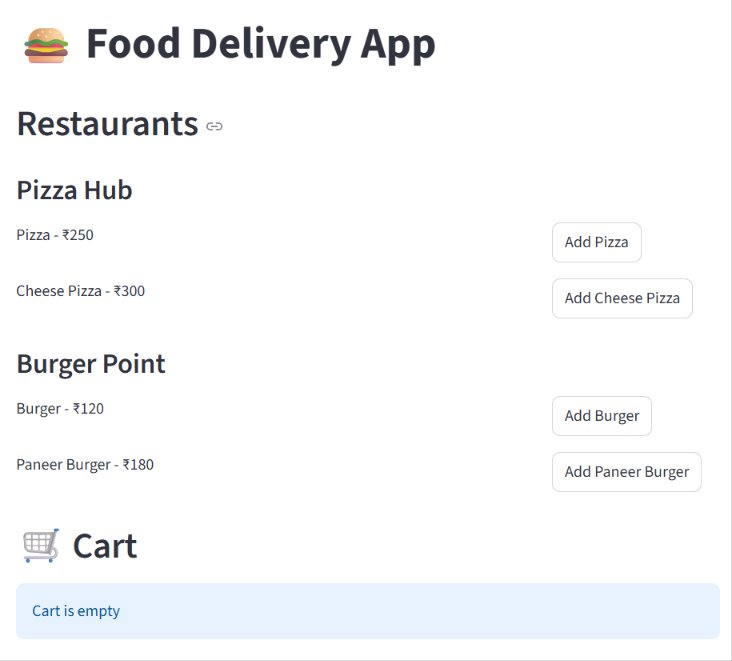

# 🍔 Food Delivery System

A simple and interactive **Food Delivery System** built using **Python (OOP)** and **Streamlit**, allowing users to browse restaurant menus, add items to a cart, and place orders — all through a clean, real-time web dashboard.


---

## 📸 Preview



---

## ✨ Features

- 🏬 **Multiple Restaurants** – Browse menus from different restaurants (e.g., Pizza Hub, Burger Point)
- 🍽️ **Dynamic Menu Display** – Each restaurant shows its items with prices
- 🛒 **Add to Cart** – Add menu items to your cart with a single click
- 📋 **Real-Time Cart & Total** – Cart updates instantly and calculates total price
- ✅ **Order Placement** – Place an order and get a unique Order ID, timestamp, and order summary
- 🧱 **Object-Oriented Design** – Built using OOP concepts with separate classes for `User`, `Restaurant`, `MenuItem`, `Cart`, and `Order`

---

## 🛠️ Tech Stack

| Technology | Purpose |
|------------|---------|
| Python | Core application logic (OOP-based) |
| Streamlit | Web interface / dashboard |
| UUID | Unique order ID generation |
| Datetime | Order timestamp tracking |

---

## 🧩 Project Design (OOP Classes)

| Class | Responsibility |
|-------|----------------|
| `MenuItem` | Represents a food item with name and price |
| `Restaurant` | Holds restaurant name and its menu |
| `Cart` | Manages items added by the user, calculates total |
| `User` | Stores user details (name, address) and their cart |
| `Order` | Generates order ID, stores ordered items, total, and timestamp |

---

## 📂 Project Structure

```
Food-Delivery-System/
│
├── Food_delivery.py       # Main application file
├── requirements.txt       # Project dependencies
├── screenshot.png          # App preview image
└── README.md              # Project documentation
```

---

## 🚀 Installation & Setup

1. **Clone the repository**

```bash
git clone https://github.com/shivajibundela/Food-Delivery-System.git
cd Food-Delivery-System
```

2. **Install dependencies**

```bash
pip install -r requirements.txt
```

3. **Run the application**

```bash
streamlit run Food_delivery.py
```

4. Open the local URL shown in the terminal (usually `http://localhost:8501`) in your browser.

---

## 🔮 Future Improvements

- Add user authentication / login system
- Connect to a database (SQLite/MySQL) for storing orders persistently
- Add payment gateway integration
- Order history tracking for users
- Admin panel to manage restaurants and menu items

---

## 👨‍💻 Author

**Shivaji Bundela**  
🔗 [GitHub](https://github.com/shivajibundela) | [LinkedIn](https://linkedin.com/in/shivaji-bundela-80ab693a7)

---

⭐ If you found this project useful, consider giving it a star on GitHub!
